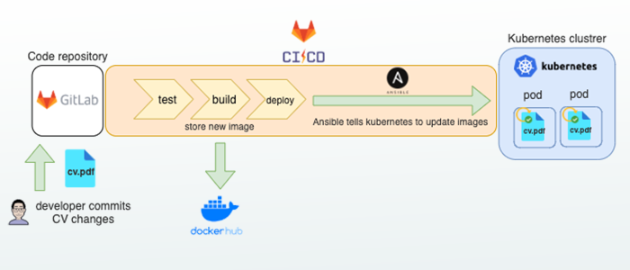
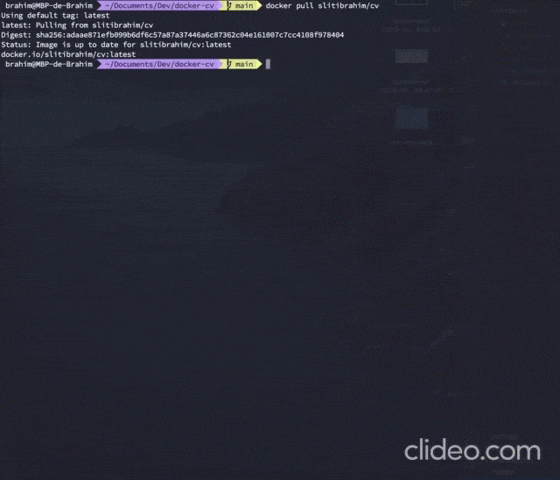

<!-- PROJECT LOGO -->
<br />
<p align="center">
  <a href="https://gitlab.com/SlitiBrahim/docker-cv">
    
  </a>

  <h3 align="center">docker-cv: My CV running in the cloud.</h3>
</p>

# docker-cv
As a DevOps Engineer, I want my CV to be like any other application: tested, built and deployed through a CI/CD pipeline.

In that way, when I update my `pdf` CV, I can automatically deploy my new CV and make it available online.

My resume available [here](http://sliti-brahim.com/cv) is running on a Kubernetes cluster in the cloud and this is the code repository of that application you can explore and use for you own CV.

## Pipeline



## Docker image

My CV is bundled into a docker container anyone can pull and see on its computer.

### Pull the image

```sh
$ docker pull slitibrahim/cv
```

### Copy the pdf CV to your host

```sh
$ docker run -d --name cv slitibrahim/cv
$ docker cp cv:/cv/cv.pdf .
```

### Run the application on your host

```sh
$ docker run -p 80:80 slitibrahim/cv
```

You can now navigate to http://localhost:80 and see the CV.


### Interact with my CV directly in your terminal



```ssh
$ docker run --rm --it slitibrahim/cv bash
$ brahim
```